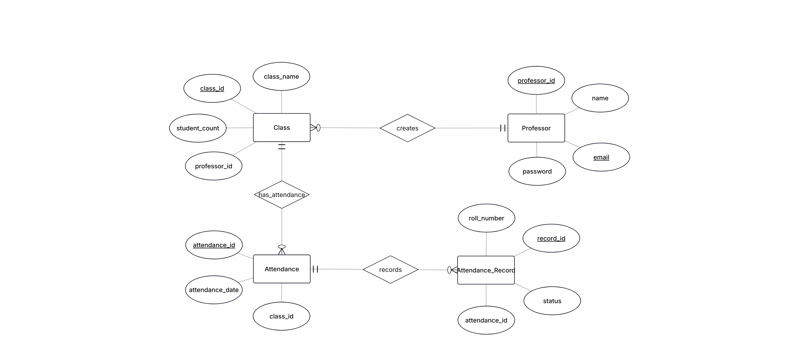

# Student Attendance Management System

A full-stack Flask web application for managing student batches, tracking attendance, and visualizing average attendance metrics.



---

## 🚀 Features

- **User Authentication**: Secure user registration, password hashing (Bcrypt), and session management (Flask-Login).
- **Batch Management**: Create and delete student batches with customized student capacity.
- **Attendance Tracking**: Easily mark present/absent status for students by roll number per session.
- **Analytics & Dashboard**: Real-time calculation of total sessions conducted and average attendance percentage per batch.
- **Relational Database**: Cascade deletions and relational mappings using SQLAlchemy ORM.

---

## 🛠️ Tech Stack

- **Backend**: Python 3, [Flask](https://flask.palletsprojects.com/), [Flask-SQLAlchemy](https://flask-sqlalchemy.palletsprojects.com/), [Flask-Login](https://flask-login.readthedocs.io/), [Flask-Bcrypt](https://flask-bcrypt.readthedocs.io/)
- **Frontend**: HTML5, CSS3, JavaScript, Jinja2 Templates
- **Database**: SQLite (default, configurable via environment variable)

---

## 📁 Project Structure

```text
DBMSL-Project/
├── app/
│   ├── routes/
│   │   ├── auth.py         # Authentication (Register, Login, Logout)
│   │   ├── dashboard.py    # Batch management & attendance recording
│   │   └── home.py         # Landing page route
│   ├── templates/          # Jinja2 HTML templates (dashboard, batch, auth)
│   ├── extensions.py      # Extension instances (db, bcrypt, login_manager)
│   ├── models.py          # Database models (User, Batch, Attendance, AttendanceRecord)
│   └── __init__.py        # App factory & route blueprints registration
├── docs/
│   └── erd.png             # Entity-Relationship Diagram
├── config.py               # App configuration settings
├── requirements.txt        # Python package dependencies
└── README.md               # Project documentation
```

---

## 📊 Database Schema

The database consists of 4 main relational entities:

1. **User (`users`)**: Stores user email (Primary Key), username, and hashed password.
2. **Batch (`batches`)**: Linked to `User`. Stores `batch_id`, `batch_name`, `student_count`, and user reference.
3. **Attendance (`attendances`)**: Linked to `Batch`. Stores `attendance_id` and `attendance_date`.
4. **AttendanceRecord (`attendance_records`)**: Linked to `Attendance`. Stores `roll_number` and attendance status (`1` for present, `0` for absent).

---

## ⚙️ Installation & Setup

### Prerequisites

- Python 3.10+ installed
- `pip` or `uv` package manager

### 1. Clone the Repository

```bash
git clone https://github.com/navale-shubham/DBMSL-Project.git
cd DBMSL-Project
```

### 2. Create and Activate Virtual Environment

**Using `venv`:**
```bash
python -m venv .venv
# On Windows:
.venv\Scripts\activate
# On macOS/Linux:
source .venv/bin/activate
```

### 3. Install Dependencies

```bash
pip install -r requirements.txt
```

### 4. Configuration (Optional)

Create environment variables or modify `config.py` if needed:
- `SECRET_KEY`: Secret key for session security (default: `secret-key`)
- `DATABASE_URL`: Database connection string (default: `sqlite:///users.db`)

### 5. Run the Application

```bash
flask --app app run
```

Access the application in your web browser at `http://127.0.0.1:5000`.

---

## 📝 License

This project is developed as part of the Database Management System Laboratory (DBMSL) course.
